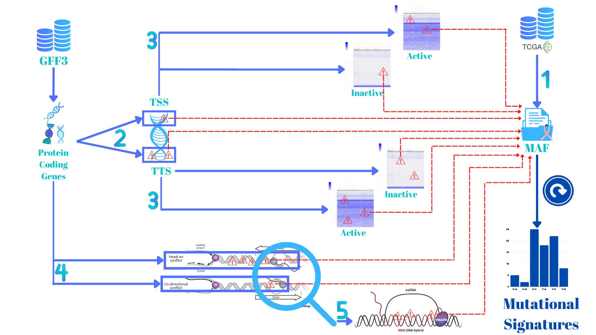

# Analysis of Cancer Mutational Signatures Associated With Replication Stress

## M2 Internship - [Replication Program and Genome Instability Team](https://institut-curie.org/team/chen)


# Table of Contents

* [General Information](#General-Information)
* [Requirements](#Requirements)
* [Installation](#Installation)
* [Pipeline](#Pipeline)

# General Information

## Aim of the project

There is mounting evidence suggesting that the replication program and the replication stress play a significant role in shaping the mutational landscape of a cancer genome. Hence, we hypothesize that there might be mutational signatures specific to different replication stresses. Furthermore, there could be an association between the rates at which certain mutational processes operates and replication stress occurrence. To that end, the goal of this project is to search for mutational signatures associated with replication stress. More specifically, if there are different mutational processes operating at transcription starting sites (TSS) and TTS of a given set of genes and if there is a mutational asymmetry between the two regions, and what are their association with transcription-associated replication stress and/or R-loop formation. This will provide novel insights to better understand the mechanisms associated with mutation signatures and their roles in genome evolution and cancer development.  

## Data Acquisition

The data was downloaded from [TCGA website](https://portal.gdc.cancer.gov/).
The Two datasets used in this analysis are the BReast-CAncer (BRCA) and the BLadder CAncer (BLCA) MAF files.
The RNA-Seq data was obtained from the [recount2 website](https://jhubiostatistics.shinyapps.io/recount/)
The data should be organized as follow:

    TRC-related-mutational-signatures
				└─── Data
					└─── dataset (BRCA or BLCA) 				
						└──── Original 
							└──── All
								└──── (brca or blca).maf

# Requirements

- [matplotlib==3.5.1](https://matplotlib.org/)
- [numpy==1.22.2](https://numpy.org/)
- [pandas==1.4.2](https://pandas.pydata.org/)
- [plotly==5.3.1](https://plotly.com/)
- [scikit-learn==1.0.1](https://scikit-learn.org/)
- [scipy==1.7.1](https://scipy.org/)
- [seaborn==0.11.2](https://seaborn.pydata.org/)
- [SigProfilerExtractor==1.1.4](https://osf.io/t6j7u/wiki/home/)
- [SigProfilerMatrixGenerator==1.2.4](https://osf.io/s93d5/wiki/home/)
- [sigProfilerPlotting==1.2.1](https://osf.io/2aj6t/wiki/home/)

## Install packages:


```
sudo pip3 install -r requirements.txt
```


## Download repository:

```
https://github.com/Ala-Eddine-BOUDEMIA/TRC-related-mutational-signatures
```


```
cd TRC-related-mutational-signatures
```

# Pipeline



## Step 1 

- Data acquisition from TCGA as MAF files and signature extraction using SigProfiler. 

## Step 2 

- Extracting the coordinates of protein coding genes and their TSS and TTS regions.
- Attribute mutations to each region.
- Signature extraction using SigProfiler.

## Step 3 

- Defining active and inactive genes in each cohort.
- Separate TSS and TTS regions to active and inactive.
- Attribute mutations to each region.
- Signature extraction using SigProfiler. 

## Step 4 

- Defining gene pairs that are in a co-directional, divergent or convergent orientations.
- Extract the coordinates of the regions between them.
- Attribute mutations to each region.
- Signature extraction using SigProfiler.

## Step 5 

- Attribute mutations to regions with and without R-loops.
- Signature extraction using SigProfiler.